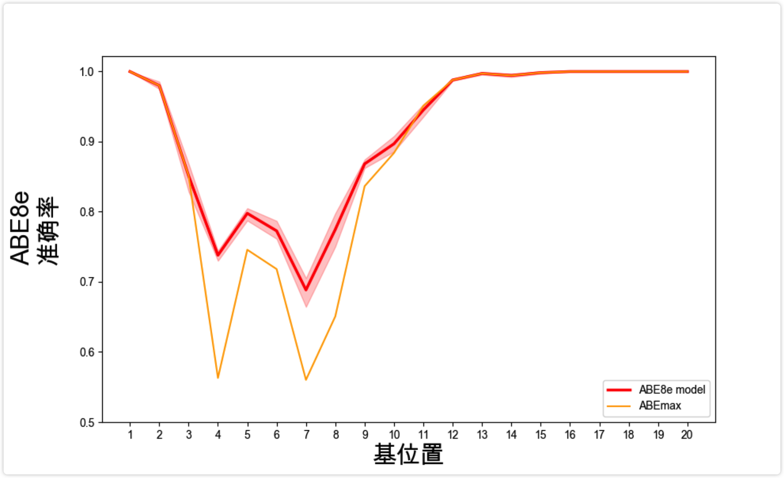
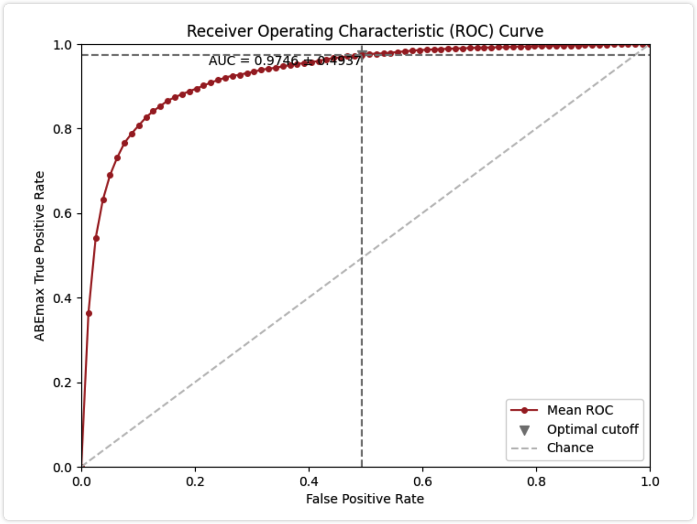
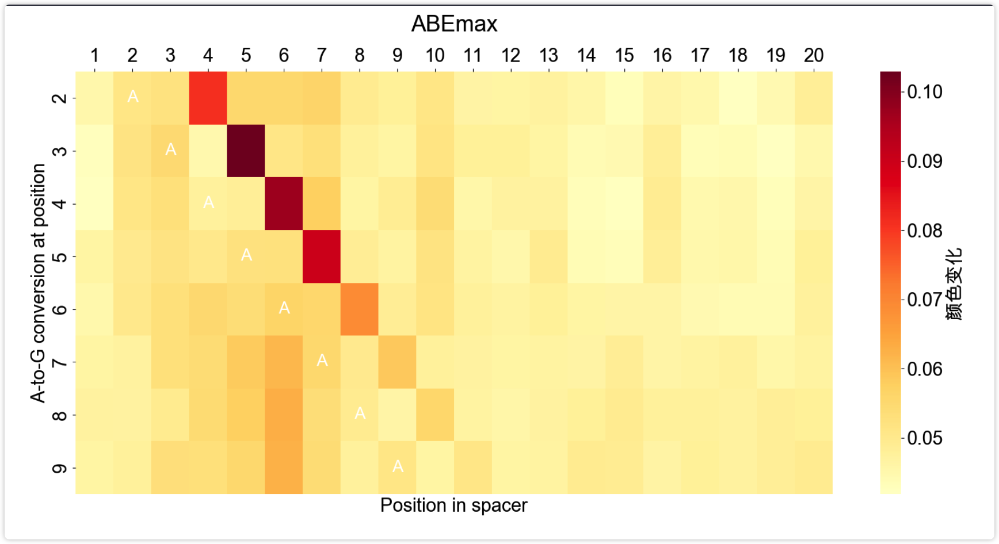

# BEtools


-20230708004256456.(null))

-20230708004256453.(null))

-20230708004256597.(null))

-20230708004256347.(null))








```python
.
├── demo
│   ├── bystander_csv_flask.py 旁编辑预测模块前端入口
│   ├── perbase_demo_flask.py 单碱基编辑预测模块前端入口 
│   └── templates
│       ├── hello.html
│       └── index.html
├── haplotype 旁编辑预测后端程序
│   ├── data_preprocess.py
│   ├── dataset.py
│   ├── hyperparam.py
│   ├── model.py
│   ├── predict_model.py
│   ├── utilities.py
├── perbase 单碱基编辑预测后端程序
│   ├── attnetion_analysis.py
│   ├── data_preprocess.py
│   ├── dataset.py
│   ├── model.py
│   ├── predict_model.py
│   ├── run_workflow.py
│   └── utilities.py
├── sample_data 演示数据和预测结果保存点
│   ├── abemax_sampledata.csv
│   ├── bystander_sampledata.csv
│   ├── bystander_webapp_abedata.csv
│   ├── fig_dir
│   │   ├── max
│   │   ├── mean
│   │   │   ├── ABE8e_seqattn_seq_0_basepos_5_predoption_mean.png
│   │   └── median
│   ├── predictions
│   │   ├── predictions_allruns.csv
│   │   ├── predictions_predoption_max.csv
│   │   ├── predictions_predoption_mean.csv
│   │   ├── predictions_predoption_median.csv
│   │   └── proc_df_allrun.csv
│   ├── predictions_haplo
│   │   ├── ABE8e_seq_4_haplotype.html
│   └── source_data_sample 测序原始数据
│       ├── M2_ESM.xlsx
│       ├── M3_ESM.xlsx
│       ├── M4_ESM.xlsx
│       ├── M6_ESM.pdf
│       ├── M8_ESM.xlsx
│       └── sns_plot.xls
├── train_models 模型训练
│   ├── ABEmaxTransformerv1.0
│   │   ├── test
│   │   │   ├── run_0
│   │   │   │   ├── config
│   │   │   │   │   ├── exp_options.pkl
│   │   │   │   │   └── mconfig.pkl
│   │   │   │   ├── figures
│   │   │   │   │   └── test.pdf
│   │   │   │   ├── predictions_test.csv
│   │   │   │   ├── score_test.pkl
│   │   │   │   ├── seqid_fattnw_map_test.pkl
│   │   │   │   └── test.log
│   ├── attnetion_analysis.py 注意力分析
│   ├── data 划分后的数据
│   │   └── M2_ESM.xlsx
│   ├── data_preprocess.py 数据预处理
│   ├── dataset.py 转成pytorch的dataset
│   ├── fig_plot 绘制性能和对比图
│   │   ├── AUC_plot.py
│   │   ├── AUC_plot_auc.py
│   │   ├── FPRTPR.py
│   │   ├── accuracy_plot.py
│   │   ├── bar_plot.py
│   │   ├── data
│   │   │   └── sns_plot.xls
│   │   ├── heatmap_plot.py
│   │   ├── pic
│   │   │   ├── AUC_pic.png
│   │   │   ├── accuracy_pic.png
│   │   │   ├── bar_pic.png
│   │   │   └── heatmap_pic.png
│   │   └── pic.png
│   ├── model.py 模型架构
│   ├── run_workflow.py 模型优化设置
│   ├── test.py 模型测试设置
│   ├── train_model.py 模型训练
│   └── utilities.py 常用模块
├── trained_models 最终模型
│   ├── bystander
│   │   ├── ABE8e
│   │   │   └── train_val
│   │   │       ├── run_0
│   │   │       │   ├── config
│   │   │       │   │   ├── exp_options.pkl
│   │   │       │   │   └── mconfig.pkl
│   │   │       │   └── model_statedict
│   │   │       │       └── HaplotypeTransformer.pkl
│   │   │       ├── run_1
│   │   │       │   ├── config
│   │   │       │   │   ├── exp_options.pkl
│   │   │       │   │   └── mconfig.pkl
│   │   │       │   └── model_statedict
│   │   │       │       └── HaplotypeTransformer.pkl
│   │   │       ├── run_2
│   │   │       │   ├── config
│   │   │       │   │   ├── exp_options.pkl
│   │   │       │   │   └── mconfig.pkl
│   │   │       │   └── model_statedict
│   │   │       │       └── HaplotypeTransformer.pkl
│   │   │       ├── run_3
│   │   │       │   ├── config
│   │   │       │   │   ├── exp_options.pkl
│   │   │       │   │   └── mconfig.pkl
│   │   │       │   └── model_statedict
│   │   │       │       └── HaplotypeTransformer.pkl
│   │   │       └── run_4
│   │   │           ├── config
│   │   │           │   ├── exp_options.pkl
│   │   │           │   └── mconfig.pkl
│   │   │           └── model_statedict
│   │   │               └── HaplotypeTransformer.pkl

240 directories, 392 files

```
